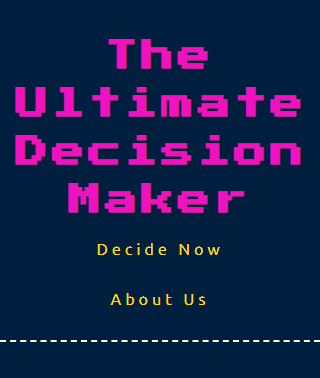
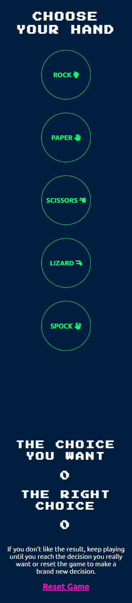

# Welcome to The Ultimate Decision Maker

The Ultimate Decision Maker is a tongue-in-cheek online game, here to help you make the difficult decisions in your life.

Based on the popular online game 'Rock Paper Scissors Lizard Spock', which is in turn based on the popular real life game 'Rock Paper Scissors', the game can be used to make non-binding decisions without the mental effort required of deciding or to settle objective disagreements between friends and family.

It is a demonstration of my HTML, CSS and JavaScript skills as required by Portfolio 2 Assessment as part of the Code Institute Diploma in Full Stack Software Development.

 
<strong>The live website can be found <a href="https://somekindofdesign.github.io/ultimate-decision-maker/">here</a>
</strong>
 

Image by <a href="https://www.freepik.com/free-psd/artist-room-decorated_12220977.htm#query=device%20mockup&position=1&from_view=keyword">Freepik</a>
  

## Contents
1. [User Experience](#user-experience)
    1. [User Goals](#user-goals)
    2. [User Stories](#user-stories)
    3. [Brand Design](#brand-design)
    4. [Accessibility](#accessibility)
    5. [Responsivity](#responsivity)
2. [Features](#features)
    1. [Existing Features](#existing-features)
    1. [Features to Implement](#features-to-implement)
3. [Testing](#testing)
    1. [Manual Testing](#manual-testing)
    2. [Code Validation and the Console](#code-validation-and-the-console)
    3. [Google Lighthouse](#google-lighthouse)
    4. [Browser Validation](#browser-validation)
    5. [User Experience Testing](#user-experience-testing)
4. [Unfixed Bugs](#unfixed-bugs)
5. [Deployment](#deployment)
    1. [Deployment](#deployment)
    2. [Cloning](#cloning)
    3. [Forking](#forking)
6. [Credits](#credits)
    1. [Code](#code)
    2. [Content](#content)
    3. [Media](#media)
  

## User Experience

Prior to development, the Ultimate Decision Maker was wireframed using design software, <a href="https://www.figma.com/">Figma</a>. This was to ensure that the design and user experience of the website was explored. Although significant changes were made during development, it provided vital foundational structure to the project.

  

### User Goals
<ul>
<li>Come to a conclusion with little input</li>
<li>Make an objective decision between two options</li>
</ul>
 

### User Stories

It is assumed that all users have access to a device capable of connecting to the internet.

<ul>
<li>I'm hungry and tired and want to order food for delivery to my house but can't decide if I want to order pizza or sushi</li>
<li>We want to watch a film together but I want to watch a horror and my partner wants to watch a comedy</li>
<li>While socialisng together, my housemate voices their opinion that Ariana Grande has the best songs but I want to demonstrate that it is, in fact, Dua Lipa that has the best songs</li>
<li>I'm feeling a bit lonely today but I work 40 hours a week and commute 2 hours a day so I can't decide if I should adopt a Siberian Husky puppy or not</li>
</ul>
 

### Brand Design

The website mimics the static, blocky style of early arcade games such as Pacman and Space Invaders. Classic games have seen a revival in popular culture over the last number of years and the Ultimate Decision Maker aims to be part of that nostalgia.
<ul>
<li><strong>Colour:</strong> The colour palette uses a dark background and bright, solid colours to highlight different functions and features while relying on white for important detailed information</li>
<li><strong>Typography:</strong> By using a pixel font for large, headline type and a clean sans-serif for smaller informative type, the typography upholds the arcade theme while maintaining legibilty</li>
<li><strong>Imagery:</strong> Relying on using repeated icons throughout the website and the game itself is a style choice that mimics the limitations of classic arcade games. In fact, photography could look out of place on the website</li>
</ul>
 

### Accessibility

Colour schemes, typography, button sizes and icon sizes have been designed to align with <a href="https://www.w3.org/WAI/standards-guidelines/wcag/">WCAG 2.0 accessbility guidelines</a> up to a minimum of AA standard.

 

### Responsivity

The website was designed and built mobile first (from 320px) with each element considered for behaviour on all devices from initial sketching. Em, rem and percentage units and media queries are used were appropriate ensuring an optimised experience for all. Similarly, maximum width has been applied to accommodate extra large screens.

[Back to top](#welcome-to-the-ultimate-decision-maker)
  

## Features

The first release of the Ultimate Decision Maker website includes several vital features which are detailed below. Future releases should include additional features as outlined in the Features to Implement section below.

 

### Existing Features
<strong>Landing</strong>

The goal of the landing page is to entice and interest the user into playing the game while simultaneously introducing them to the brand. It includes several key markers including the logo in the header, the stylised type and the icons demonstrating the choices in the game.

 

<strong>Navigation</strong>

Featured on all pages, this fully responsive navigation includes links to the landing page, the game and an about page. It is exactly replicated across the website to ensure consistency for the user.

The navigation allows users to browse the website from any page without having to use the back button on their device.

 

<strong>Decision Maker Game</strong>

The core of the website, this is the game function. Users are provided with instruction and visual cues direct them through the game as they play. They can choose their hand repeatedly and continue the game indefinitley if they wish or reset the game and start over.

 

<strong>Submit Ideas Form</strong>

Here users have the opportunity to contact the game developer with their own idea for a similar game.

 

<strong>Footer</strong>

The footer includes links to relevant social media websites, opened in new tabs to avoid taking the user away from this website.

 

### Features to Implement
<ul>
    <li>Users can personalise the game with custom labels for the choices (e.g. Pizza v Sushi instead of The Choice You Want v The Right Choice)</li>
    <li>Users can play 'Best of 3' or 'Best of 5' games</li>
    <li>Users can add multiple players (Pizza vs Sushi vs BBQ) to the game</li>
</ul>

In addition to the above, users should be able to learn how to play the game through a choice comparison function. This feature was built during development and was part of a How-to page. However, it required further debugging and failed QA and usability tests. It was removed before deployment/project deadline and the code saved outside of the project to assist with future iterations of the website.

[Back to top](#welcome-to-the-ultimate-decision-maker)
  

## Testing

Throughout the development of this website, testing was carried out on multiple browsers including Chrome, Firefox and Microsoft Edge on Windows 10. The developer tools of these browsers were used to mimic different device sizes. For all testing, each page was asessed across the following criteria;
<ul>
    <li>Layout and positioning (ie is everything where it's expected to be on all devices)</li>
    <li>Functions (ie buttons, links, inputs, etc)</li>
    <li>Features (ie game play, form fill and submission, etc)</li>
    <li>Consistency, convention and expectation (ie does it allow affordance to the user)</li>
</ul>

 

### Manual Testing

Manual testing was conducted by both the developer and an external tester using the following test cases. No unexpected errors were found during this phase.

 

<strong>Test Case 1 </strong>

<strong>Title: </strong>Game play - play a game of rock paper scissors lizard spock

<strong>Description: </strong>A user should be able to make a selection from the given options and have it compared to an auto-generated selection multiple times then know the outcome of each comparison

<strong>Precondition: </strong>The user is familiar with the concept of rock paper scissors or rock paper scissors lizard spock

<strong>Assumption: </strong>A browser app on a device with connection to the internet is being used

<strong>Test Steps:</strong>
<ul>
<li>Navigate to The Ultimate Decision Maker game website</li>
<li>Click the 'Decide Now' link in the nav menu</li>
<li>Scroll to the options and select one</li>
<li>Expected Result: User choice is displayed, auto-generated choice is displayed, result of game is displayed and game score is updated (unless there is a tie)</li>
<li><strong>Actual Result: As expected</strong></li>
</ul>
 

<strong>Test Case 2</strong>

<strong>Title: </strong>Send an idea

<strong>Description: </strong>A user should be able to fill in their name, some text and their email address in the fields provided

<strong>Precondition: </strong>The user has an email address

<strong>Assumption: </strong>A browser app on a device with connection to the internet is being used

<strong>Test Steps:</strong>
<ul>
<li>Navigate to The Ultimate Decision Maker game website</li>
<li>Click the 'About Us' link in the nav menu</li>
<li>Scroll to the form and fill in the fields provided</li>
<li>Expected Result: The form posts the data to the Code Institute form dump and a success message is displayed</li>
<li><strong>Actual Result: As expected</strong></li>
</ul>
 

### Code Validation and the Console

The console does not return any errors.

<ul>
    <li><strong>HTML:</strong> No errors or warnings were returned by <a href="https://validator.w3.org/">W3C Markup Validation Service</a></li>
    <li><strong>CSS:</strong> No errors or warnings were returned by <a href="https://jigsaw.w3.org/css-validator/">W3C CSS Validation Service</a></li>
    <li><strong>JavaScript:</strong> No errors were returned by <a href="https://jshint.com/">JS Hint</a>, however each page received multiple warnings that read "X is available in ES6 (use 'esversion: 6') or Mozilla JS extensions (use moz)"</li>
</ul>
 

### Google Lighthouse

All pages of the Ultimate Decision Maker website were tested using the Google Lighthouse tool, through Google Chrome Developer tools and <a href="https://web.dev/measure/">Web.dev</a>.

<ul>
    <li>Performance - 89 (Home), 91 (Decide Now), 88 (About)</li>
    <li>Accessibility - 100 (All)</li>
    <li>Best Practices - 100 (All)</li>
    <li>SEO - 100 (All)</li>
</ul>
 

### Browser Validation

Browser testing was conducted manually on the following apps:

<ul>
    <li>Chrome - Desktop & Mobile</li>
    <li>Firefox - Desktop & Mobile</li>
    <li>Opera - Desktop & Mobile</li>
    <li>MS Edge - Desktop</li>
    <li>DuckDuckGo - Mobile</li>
    <li>Samsung Internet - Mobile</li>
</ul>
 

As there was no access to Apple products at the time of testing, <a href="https://lambdatest.com">LambdaTest.com</a> was used to test Apple mobile devices using Opera and Chrome browser apps and Safari on MacOS.

Samsung and Apple both overwrite some styles including dropdown menus and some buttons. Further investigation is needed to evaluate if there is a need to address this and how it would be accomplished. Other than those identified during development and documented in the 'Unfixed Bugs' section below, no bugs or discrepencies were discovered and the website was verified to be consistant across browsers.

 

### User Experience Testing

Tests were conducted with 3 users, one in-person and two remotely using <a href="https://zoom.us">Zoom</a>. All were tested on mobile first then seperately on desktop devices. In all cases, users understood the purpose of the website and the game, they had no issues navigating or playing the game and the experience was reported to be overall, a positive one.

[Back to top](#welcome-to-the-ultimate-decision-maker)
  

## Unfixed Bugs

There are several bugs that need to be addressed in the next iteration of this project. None are currently blocking game-play or make the website difficult to use but all would improve the overall user experience.

<ul>
    <li><strong>Space between content:</strong> Empty divs before the game function is executed are creating unnecessary space between the game and related content (score and reset) requiring additional scrolling on mobile.</li>
    <li><strong>Game reset position:</strong> Currently when the user resets the game on tablet or mobile devices, the page reloads and the user is brought back to the top of the page and away from the game. A different solution is required to reset the scores while preserving the scroll position.</li>
    <li><strong>Form success:</strong> After submitting the form the user sees a new tab open and a confirmation page from the Code Institute's form dump. A solution is required to prevent the tab opening without blocking the data from being sent.</li>
    <li><strong>Form input clear:</strong> After submitting the form the data the user has entered into the input fields remain there. An event listener was added to clear them once the submit was clicked but this cleared the fields before the data was posted. An attempt to add a delay after the event was not successfully debugged before the project deadline and removed from this iteration.</li>
    <li><strong>How-to compare function:</strong> The function appears not to work beyond the first if statement (a tie). No errors are visible in the console, no errors are visible in jshint and attempts to debug using console.log have been unsuccessful as the log appears at every point tested. Although this is not part of the main function of the website, it has been removed from this iteration of the project. All code written so far is saved outside the project.</li>
</ul>

[Back to top](#welcome-to-the-ultimate-decision-maker)
  

## Deployment

### Deployment

As part of the Code Institute submission process, this website was deployed to GitHub pages. The steps to deploy are as follows:

<ol>
    <li>Open github.com and log in to user account</li>
    <li>Find the Ultimate Decision Maker repository</li>
    <li>In the GitHub repository, navigate to the Settings tab</li>
    <li>Find the page section on the left hand menu</li>
    <li>Check source is 'Deploy from branch'</li>
    <li>Check branch is 'main'</li>
    <li>Click save</li>
</ol

<strong>The live website can be found here - <a href="https://somekindofdesign.github.io/ultimate-decision-maker/">https://somekindofdesign.github.io/ultimate-decision-maker/</a>
</strong>

Initial depolyment was successful and subsequent testing across multiple browsers found no discrepencies.

 

### Cloning

If cloning is required then please follow the below steps:

<ol>
    <li>Open github.com and log in to user account</li>
    <li>Find the Ultimate Decision Maker repository</li>
    <li>In the GitHub repository, click the Code button</li>
    <li>Choose which method you would like to clone by; HTTPS or SSH or Github CLI</li>
    <li>Copy the URL provided by your chosen method</li>
    <li>Got to Git Bash and change the current working directory to the new clone location</li>
    <li>Type git clone, and then paste the URL you copied earlier (eg: $ git clone https://github.com/username/cloned-repository-name)</li>
    <li>Click Enter to start the cloning process</li>
</ol>
 

### Forking

If forking is required then please follow the below steps:

<ol>
    <li>Open github.com and log in to user account</li>
    <li>Find the Ultimate Decision Maker repository</li>
    <li>In the top right corner, click the Fork button</li>
    <li>Select an owner for the forked repository</li>
    <li>Choose to use the same name as the forked repository or create a new name</li>
    <li>You can also add a description</li>
    <li>Only the default branch is copied by default but you can choose to copy all the branches</li>
    <li>Click Create fork</li>
</ol>

[Back to top](#welcome-to-the-ultimate-decision-maker)
  

## Credits

### Code

The code from this project was implemented by the project owner, Louise Stanley. Additional help, guidance and code were also used from the below sources.

<strong>General</strong>
    <ul>
        <li><a href="https://learn.codeinstitute.net/courses/course-v1:CodeInstitute+JSE_PAGPPF+2021_Q2/courseware/30137de05cd847d1a6b6d2c7338c4655/c3bd296fe9d643af86e76e830e1470dd/">Code Institute Portfolio 2 Assessment Guide</a> -> used for project idea and general project guidance including this ReadMe file</li>
        <li><a href="https://learn.codeinstitute.net/courses/course-v1:CodeInstitute+LM101+2021_T1/courseware/2d651bf3f23e48aeb9b9218871912b2e/234519d86b76411aa181e76a55dabe70/">Code Institute Love Maths</a> -> used for troubleshooting and guidance</li>
        <li><a href="https://www.w3schools.com/js/">W3Schools Javascript Tutorial</a> -> used for general troubleshooting and debugging</li>
    </ul>

<strong>Game Play</strong>
    <ul>
        <li><a href="https://www.geeksforgeeks.org/rock-paper-and-scissor-game-using-javascript/">Rock Paper Scissors Game with JavaScript</a> by Pritishnagpal through GeeksForGeeks.com</li>
        <li><a href="https://javascript.plainenglish.io/building-a-rock-paper-scissors-game-with-javascript-bce23d39509d">Building a Rock Paper Scissors Game with JavaScript</a> by Mehdi Aoussiad through JavascriptInPlainEnglish.io</li>
    </ul>

<strong>Game Score</strong>
    <ul>
        <li><a href="https://betterprogramming.pub/7-ways-to-code-rock-paper-scissors-in-javascript-4189a5e7e535">7 Ways To Code Rock Paper Scissors in JavaScript</a> by Samuele through BetterProgramming.pub</li>
    </ul>

<strong>Ghost Cursor</strong>
    <ul>
        <li><a href="https://github.com/tholman/cursor-effects">Cursor Effects</a> by Tholman through Github</li>
    </ul>
 

### Content

    <ul>
        <li>The game logic was sourced on <a href="https://bigbangtheory.fandom.com/wiki/Rock,_Paper,_Scissors,_Lizard,_Spock">Rock, Paper, Scissors, Lizard, Spock</a> through the Big Bang Theory Fandom Wiki</li>
        <li>All other content was written by the project owner, Louise Stanley</li>
    </ul>

 

### Media

    <ul>
        <li>This project relies heavily on the rock paper scissors rock lizard spock icon collection provided by <a href="https://fontawesome.com/v5/search">Font Awesome v5</a></li>
    </ul>

[Back to top](#welcome-to-the-ultimate-decision-maker)